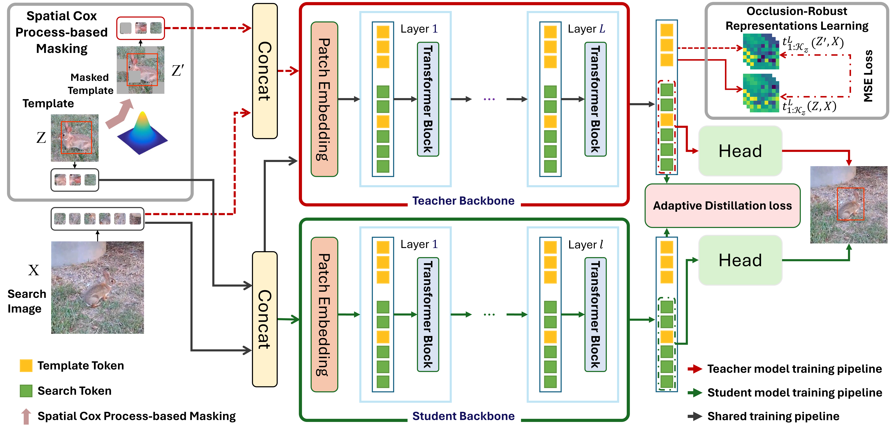
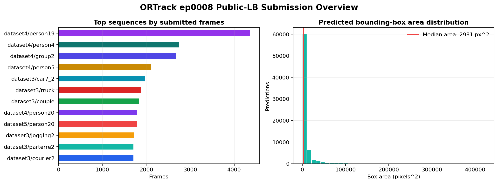

# ORTrack Final Submission ep0008



This repository packages the selected AIC 2026 final inference submission built from an `ORTrack-DeiT Tiny` checkpoint. The included checkpoint, `ORTrack_ep0008.pth.tar`, was selected as the most reliable final candidate among the tested variants.



## Repository Contents

| Path | Purpose |
| --- | --- |
| `code/ORTrack/` | Source snapshot used for inference and local evaluation. |
| `model/ORTrack_ep0008.pth.tar` | Selected trained checkpoint. |
| `submission/ortrack_deit_aic_stage1_ep0008_public_lb_submission.csv` | Public-LB prediction CSV. |
| `Dockerfile` | Reproducible inference image. |
| `run_inference.sh` | Container inference entrypoint. |
| `run_evaluation.sh` | Optional local evaluation entrypoint. |
| `technical_report.md` | Short method and reproducibility report. |

## Submission Snapshot

- Predictions: `74,293`
- Sequence groups: `89`
- Median predicted box: `41.47 x 69.96` pixels
- Median predicted box area: `2,980.55` square pixels
- Inference mode: online, first-frame initialization only
- Selected checkpoint: `ORTrack_ep0008.pth.tar`

## Native Inference

From a Windows machine with the dataset at `C:\AIC\Data`:

```powershell
$env:KMP_DUPLICATE_LIB_OK='TRUE'
python -B C:\AIC\ORTrack\make_aic_public_submission.py `
  --data-root C:\AIC\Data `
  --manifest C:\AIC\Data\metadata\contestant_manifest.json `
  --sample C:\AIC\Data\metadata\sample_submission.csv `
  --split public_lb `
  --config deit_tiny_aic_stage1 `
  --checkpoint C:\AIC\ORTrack_final_submission_ep0008\model\ORTrack_ep0008.pth.tar `
  --output C:\AIC\ORTrack_final_submission_ep0008\submission\ortrack_deit_aic_stage1_ep0008_public_lb_submission.csv
```

The inference script initializes each sequence from the first-frame annotation provided in the manifest, runs online frame-by-frame tracking at the original frame rate, and writes one prediction row for every required sample id.

## Docker Inference

Build:

```bash
docker build -t aic-ortrack-ep0008 .
```

Run inference with the competition data mounted at `/data` and an output folder mounted at `/output`:

```bash
docker run --gpus all --rm \
  -v /path/to/Data:/data:ro \
  -v /path/to/output:/output \
  aic-ortrack-ep0008
```

The output CSV is written to:

```text
/output/ortrack_deit_aic_stage1_ep0008_public_lb_submission.csv
```

## Local Evaluation

For local evaluation on the provided annotated train/validation split:

```bash
docker run --gpus all --rm \
  -v /path/to/Data:/data:ro \
  -v /path/to/output:/output \
  aic-ortrack-ep0008 /workspace/run_evaluation.sh
```

The default evaluation split file is:

```text
/workspace/ORTrack/data_specs/aic_contest_val.txt
```

## Reproducibility Notes

- Inference is online-only and does not use future frames.
- The tracker is initialized only from the first available annotated frame for each sequence.
- Predictions are produced for the original provided frame rate, not reframed or downsampled videos.
- The packaged CSV is the raw ORTrack ep0008 public-LB submission.
- Checksums for the main deliverables are recorded in `checksums_sha256.txt`.

## License

The bundled ORTrack source code is MIT licensed by its original author; see `code/ORTrack/LICENSE`. This repository preserves that source snapshot and adds AIC submission packaging around it.
